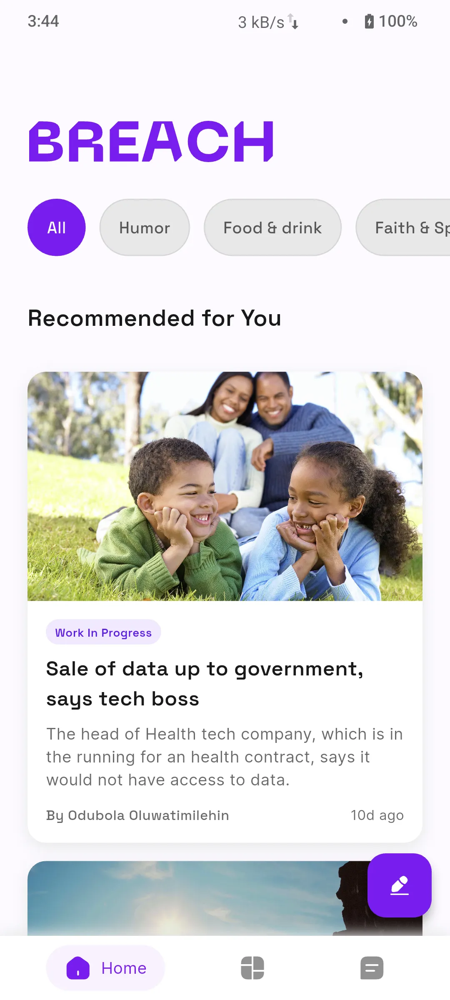
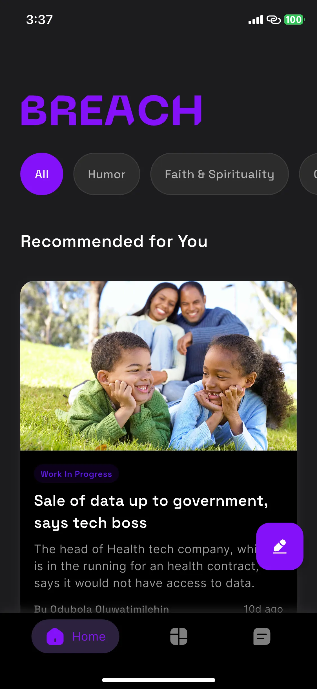

# Breach - Content Discovery Platform

A modern Flutter application for discovering and consuming personalized content through an intuitive feed-based
interface.

## 🎬 Demo Videos

📱 **[Android Demo Video](https://drive.google.com/file/d/1a70L0cyR_bBGXHgW1PZabh0MWRVdZJ9l/view?usp=sharing)**

🍎 **[iOS Demo Video](https://drive.google.com/file/d/1a7j-RhDbuBaV-_ct8YZmi_xGEQyb0ANP/view?usp=sharing)**

## 📸 Screenshots

### Light & Dark Mode Comparison

| Light Mode (Android)                    | Dark Mode (iOS)                    |
|-----------------------------------------|------------------------------------|
|  |  |

## ✨ Key Features

- **Light & Dark Mode Support**: Comprehensive theming with automatic system preference detection
- **Smooth Animations**: Custom entrance animations and micro-interactions throughout the app
- **Clean Architecture**: MVVM pattern with feature-based structure and repository pattern
- **Built-in State Management**: Using `ChangeNotifier` and `ValueNotifier` for reactive UI updates
- **Real-time Streaming**: WebSocket integration for live content updates
- **Category Filtering**: Dynamic content filtering based on user interests
- **Authentication System**: Secure login/signup with JWT token management

## 🛠️ How to Build

### Quick Start

```bash
# Clone and setup
git clone https://github.com/logickoder/breach.git
cd breach
flutter pub get

# Run the app
flutter run
```

### Build Script

```bash
#!/bin/bash
echo "🚀 Building Breach..."
flutter clean && flutter pub get
flutter build apk --release
flutter build appbundle --release
echo "✅ Build complete!"
```

## 📁 Code Structure

```
lib/
├── main.dart                 # App entry point
├── app/                      # Core infrastructure (theme, components, data)
├── auth/                     # Authentication feature
├── home/                     # Main feed with category filtering
├── onboarding/              # User onboarding flow
└── dashboard/               # Navigation container
```

### Architecture Highlights

- **MVVM Pattern**: Clean separation with ViewModels for business logic
- **Feature-Based Organization**: Each feature has its own data, domain, and UI layers
- **State Management**: Custom ViewModels extending `ChangeNotifier`
- **Repository Pattern**: Abstracted data access with clean interfaces

## 🔧 Technical Highlights

### Core Implementations

- **Theme System**: Comprehensive light/dark mode with Material Design 3
- **Animation System**: Staggered animations with `TickerProviderStateMixin`
- **WebSocket Integration**: Real-time updates for live content streams
- **Category Filtering**: Dynamic API calls with conditional query parameters

### Performance & Quality

- **Lazy Loading**: Efficient list rendering with `ListView.builder`
- **Image Caching**: Using `cached_network_image` for optimal performance
- **Type Safety**: Full Dart null safety implementation
- **Error Handling**: Comprehensive error boundaries with user feedback

## 🚀 Development

```bash
# Setup
flutter doctor -v
flutter pub get

# Development
flutter run --debug

# Build
./scripts/build.sh
```

## 📝 API Integration

- **Authentication**: JWT-based with token management
- **Content Feed**: Paginated blog posts with category filtering
- **Real-time Updates**: WebSocket for live streams
- **User Preferences**: Interest selection and profile management

## 🔗 Repository

**GitHub**: [https://github.com/logickoder/breach](https://github.com/logickoder/breach)

---

*Built with ❤️ using Flutter*
